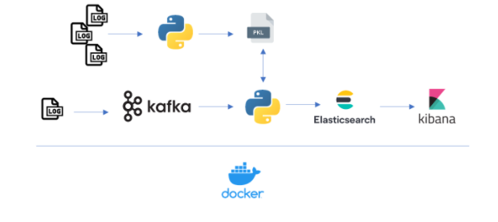

# Master Data Analytics EDEM - Trabajo Fin de Master

## Challenge from ITI (Instituto Tecnológico de Informática) 
**Processing and clasification of logs or other types of files**  


## Team 🖥️ 

* [Guillermo Adam Merino](https://www.linkedin.com/in/guillermo-adam/)
* [Inés Muñoz Arnau](https://www.linkedin.com/in/in%C3%A9s-mu%C3%B1oz-arnau-91b068177/)
* [Yaling Hu](https://www.linkedin.com/in/huyaling/)

## Architecture ⛓️ 



## Installation 🛠️  

Follow the steps to set up the enviroment.

1- Clone git repository (https://github.com/guadme/tfm_iti.git).

```sh
git clone https://github.com/guadme/tfm_iti.git
```

2- Run docker containers

```sh
docker-compose up -d
```

3- Create kafka topic called "logs-iti"

```sh
docker exec -it kafka /bin/sh

$ cd opt/bitnami/kafka/bin
$ kafka-topics.sh --create --zookeeper zookeeper:2181 --replication-factor 1 --partitions 1 --topic logs-iti
```

4 - Check if the topic has been created.

```sh
$ kafka-topics.sh --list --zookeeper zookeeper:2181
```

5- Create data directory in jupyter container where scripts will be executed.

```sh
docker exec -it jupyter /bin/sh

$ cd work
$ mkdir data
```

6- Copy scripts and data from local repository to jupyter container.

```sh
cd scripts

docker cp "consumer.py" jupyter:"home/jovyan/work"
docker cp "data.py" jupyter:"home/jovyan/work"
docker cp "ETL.py" jupyter:"home/jovyan/work"
docker cp "model.py" jupyter:"home/jovyan/work"
docker cp "producer.py" jupyter:"home/jovyan/work"
docker cp "pickle_svm.pkl" jupyter:"home/jovyan/work"
docker cp "requirements.txt" jupyter:"home/jovyan/work"

cd data
docker cp "PD_traffic_dataset.csv" jupyter:"home/jovyan/work/data"
docker cp "TR_traffic_dataset.csv" jupyter:"home/jovyan/work/data"
```

7- Install necessary python modules

```sh
docker exec -it jupyter /bin/sh
$ cd work
$ pip install -r requirements.txt
```

8- Run python scripts

```sh
docker exec -it {jupyterID} /bin/sh
$ cd work
$ python data.py
$ python ETL.py

//In another window

docker exec -it {jupyterID} /bin/sh
$ python producer.py
```

9- Navigate to https://localhost:5601 to access Kibana and see the logs ingested in Elasticsearch 
